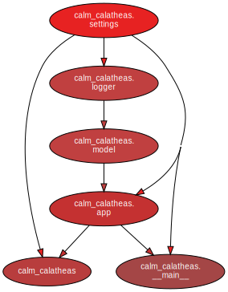

# Backend

Below is a high-level overview of the backend architecture:

This diagram was generated automatically using [`pydeps`](https://pypi.org/project/pydeps/). The detailed documentation
below was generated with [`mkdocstrings`](https://mkdocstrings.github.io/).

::: calm_calatheas.app

::: calm_calatheas.logger

::: calm_calatheas.model

::: calm_calatheas.settings
