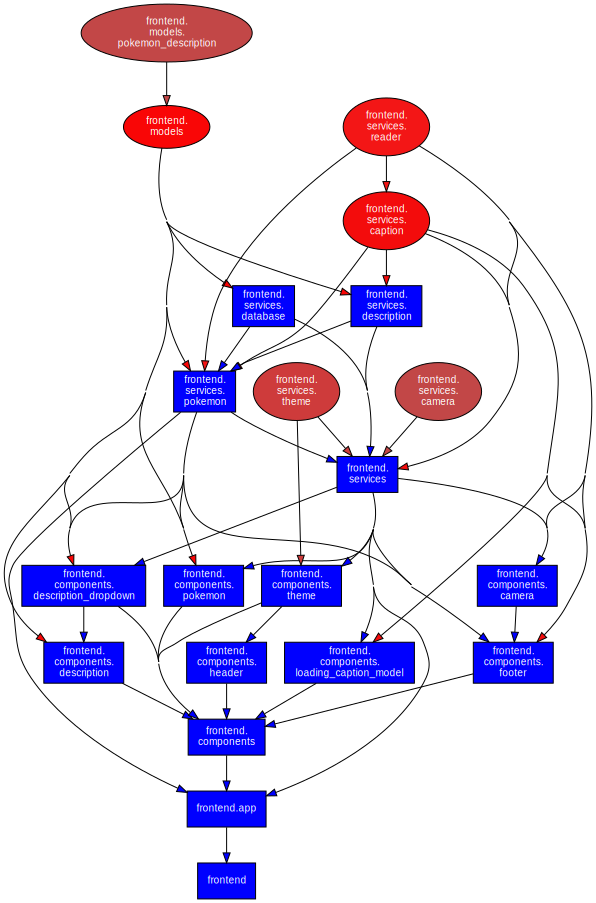

# Frontend

Below is a high-level overview of the frontend architecture:

This diagram was generated automatically using [`pydeps`](https://pypi.org/project/pydeps/).

!!! NOTE "Diagram completeness"

    To keep the diagram clear, relationships between components, services, and their base classes are not shown.

The following sections provide detailed documentation, generated automatically with [`mkdocstrings`](https://mkdocstrings.github.io/).

::: app.frontend

::: app.frontend.base

::: app.frontend.components

::: app.frontend.models

::: app.frontend.services
