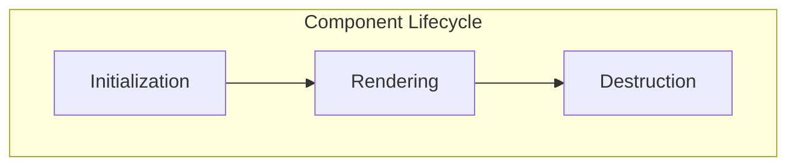
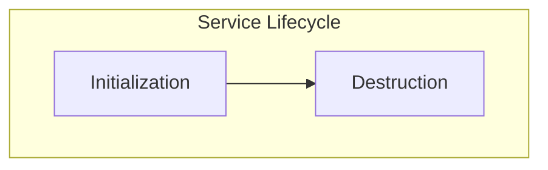

# Web App

The web app is the core of the system, responsible for the user experience, interface, and interactions. Built with [PyScript](https://pyscript.net/)
and [Pyodide](https://pyodide.org/en/stable/), it runs Python code directly in the browser. The app includes a presentation
layer and modules for camera access, image processing, and database management.

## Presentation Layer

The presentation layer manages the user interface and interactions. It is structured as a [Single Page Application (SPA)](https://en.wikipedia.org/wiki/Single-page_application)
and follows a [Model-View-Presenter (MVP)](https://en.wikipedia.org/wiki/Model%E2%80%93view%E2%80%93presenter) architecture,
which separates UI components from business logic and state management. This design keeps the application architecture
similar to modern web frameworks like React or Angular, aligning with our key design goals.

### Components

Views are organized as individual components, each responsible for a specific part of the user interface. They are all grouped
in the [`components`][app.frontend.components] module and inherit from a base [`Component`][app.frontend.base.component.Component]
class that implements rendering logic and lifecycle methods.

The lifecycle of a component includes _initialization_, _rendering_, and _destruction_. This lifecycle is typically managed
by a parent component that coordinates these phases.

**Initialization**: The component is created but not yet displayed. This phase sets up the component’s internal state
and prepares it for rendering.

**Rendering**: The component generates its HTML and inserts it into the DOM at its designated root element. Most components
also attach event listeners at this stage to handle user interactions and state changes.

**Destruction**: The component is removed from the DOM and any resources it used are released. This includes detaching
event listeners and cleaning up internal state.

Lifecycle hooks enable components to run custom logic before and after each phase of their lifecycle. These hooks provide
flexibility for setup, teardown, and responding to changes during initialization, rendering, and destruction.

### Services

Services are responsible for providing business logic and state management for the application. They encapsulate the core
functionality and can be reused across different components. Most services exist globally and can be accessed by any component
that needs them, although they can also be owned by specific components if needed.

All services are organized into the [`services`][app.frontend.services] module and inherit from the [`Service`][app.frontend.base.service.Service]
base class, which provides lifecycle management for all services.

A service’s lifecycle consists of two main phases: _initialization_ and _destruction_. Global services are managed centrally,
while services owned by specific components are managed by those components.

**Initialization**: The service is instantiated and its internal state is set up. This may include fetching initial data
or configuring dependencies.

**Destruction**: The service is cleaned up when it is no longer needed. This involves releasing resources such as event
listeners, database sessions, or network connections.

Lifecycle hooks allow services to execute custom logic before and after each phase, providing flexibility for setup, teardown,
and responding to changes during initialization and destruction.

### State Management

State is managed by services, which implement the observer pattern. This allows components to subscribe to state changes
and react as needed, decoupling state management from the presentation layer and ensuring a clean separation of concerns.

Unlike frameworks such as React or Angular, which provide built-in concepts like signals and effects, PyScript does not
offer these features natively. Instead, we use the [reactivex](https://github.com/ReactiveX/RxPY) library to manage asynchronous
data streams and events, enabling reactive programming patterns within the application.

## Camera

The camera service manages access to the user's camera and handles image capture and permissions.

Integrating camera functionality directly into the application ensures a seamless experience for users as they explore
and search for Pokémon, without needing to switch to a separate camera app. This approach also accommodates devices that
may not have a dedicated camera application.

For users without a camera, or for those who wish to analyze existing images, the application also provides an image upload
feature. This allows users to select and process images from their device, ensuring accessibility and flexibility for all
users.

## Object Recognition

The object recognition service identifies and classifies objects within images, then generates captions describing them.
These captions are passed to the description generation model, which creates Pokémon-themed descriptions based on the recognized
objects.

The object recognition service uses the [`Xenova/vit-gpt2-image-captioning`](https://huggingface.co/Xenova/vit-gpt2-image-captioning)
model, an image-to-text machine learning model. This lightweight model runs well even on devices with limited computing
power, such as smartphones. While it provides reasonable results for image captioning tasks, our experimentation shows
that its accuracy may vary depending on the input.

We originally planned to use the [`transformers`](https://pypi.org/project/transformers/) library for Python to run the
model. Unfortunately, some of its dependencies are incompatible with Pyodide because they cannot be compiled to WebAssembly.

We considered two options: moving the object recognition service to the backend to keep it in Python, or running the model
in the browser using [`transformers.js`](https://huggingface.co/docs/transformers.js/en/index) and accessing it from Python
via Pyodide. To keep with the spirit of the code jam, we chose to run the model entirely in the browser using `transformers.js`.

While we would have preferred to leverage Python’s rich machine learning ecosystem for this feature, current limitations
prevent us from doing so. Enabling advanced machine learning capabilities directly in the browser would make Python a much
stronger choice for web development and help it move beyond experimental or hobby projects.

There is a noticeable slowdown during model initialization and occasionally when processing images. To address this, we
tried running the model in a separate [web worker](https://docs.pyscript.net/2025.8.1/user-guide/workers/) to offload
processing from the main thread. However, we encountered errors loading the model in the worker and were unable to resolve
them within our timeframe. With more time, we believe this issue could be solved, but we chose to focus on other features.

## Database

The database is responsible for storing each user's Pokémon collection.

We use [IndexedDB](https://developer.mozilla.org/en-US/docs/Web/API/IndexedDB_API) as our database solution because it
is a widely supported web standard that offers a robust, asynchronous API for managing large amounts of structured data
directly in the browser.

Storing each user's collection in a client-side database means the data is kept locally in their browser. This approach
has some limitations: collections cannot be shared across devices or with other users, and all data will be lost if the
user clears their browser storage. We accept these trade-offs because using a browser-based database fits the code jam
theme and our design goals. For a future version, we would consider synchronizing the database with a remote server to
enable cross-device access and backups.

## Progressive Web App

Pokedexter is a [Progressive Web App (PWA)](https://developer.mozilla.org/en-US/docs/Web/Progressive_web_apps), meaning
it can be installed on a user's device and run like a native app. When installed, it operates in standalone mode, providing
easier access and a familiar user experience.

While some PWAs offer offline capabilities, Pokedexter currently relies on the backend for description generation and requires
an internet connection. A key improvement could be to explore or train a model that can run entirely on-device, enabling
a fully offline experience. This would enhance the fantasy of carrying a real Pokédex with you outdoors or in nature.

## Browser Support

Pokedexter is tested and works reliably on all major modern browsers, including Chromium-based browsers (such as Chrome
and Edge), WebKit-based browsers (Safari), and Firefox. To ensure consistent behavior across environments, we use [Playwright](https://playwright.dev/python/)
together with [Pytest](https://pytest.org/) and [Testcontainers](https://testcontainers.com/) for automated cross-browser
testing in a production-like environment.

You can find the test scenarios in the `tests` folder.

## CSS Framework

We chose [Bulma](https://bulma.io/) as our CSS framework because it is a modern, responsive framework that makes it easy
to create visually appealing and responsive layouts. The choice for a CSS framework rather than writing custom styles from
scratch saved us some time to focus on the functionality of the app.
