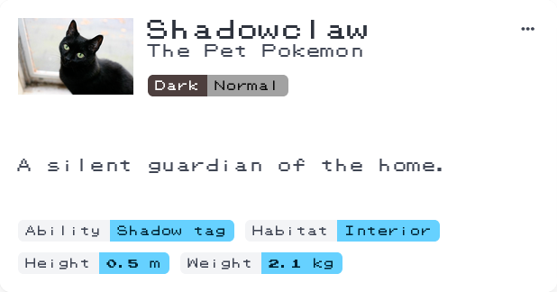
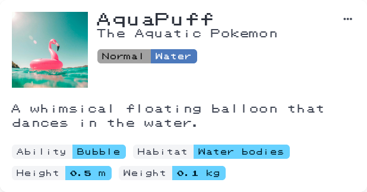
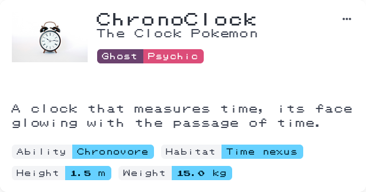
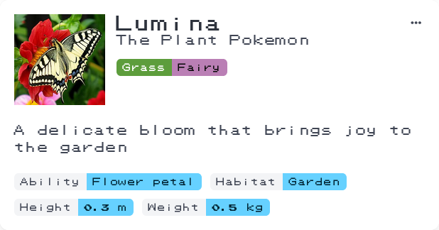

# Pokedexter

_Who's that Pokémon?_

Ever wondered if your cat could be a Pokémon? Curious about what’s hiding in your cupboard? **Pokedexter** is an AI-powered
Pokédex that helps you discover Pokémon wherever you are. Just snap a photo, and Pokedexter will identify the Pokémon—maybe
even ones you never expected!

Open Pokedexter on your phone and start discovering Pokémon all around you!

    

    

    

    

## Features

- Identify Pokémon anywhere using AI image recognition and description generation.
- Build your personal Pokémon collection—your progress is saved locally.
- Use Pokedexter on any device that supports a modern web browser.
- Designed for mobile use with a responsive layout.
- Installable as a Progressive Web App (PWA).
- Powered by a technology stack that’s 99% Python.

## Fit with the theme

The theme for this year's code jam is to write a **browser-based** Python application that is **the wrong tool for the job**.

Pokedexter is an intentionally out of place tool for Pokémon identification. It neither identifies real-world objects nor
actual Pokémon. Instead, it invites users to view their everyday surroundings through a playful, imaginative Pokémon perspective.

Most modern web apps are built with JavaScript frameworks like React or Angular. With Pokedexter, we set out to see how
closely we could replicate a typical web app experience using Python instead of JavaScript. Our goal was to apply common
web development architecture and design patterns, while also taking advantage of Python’s strengths in data processing
and machine learning.

## About the team

This project has been built by the Calm Calatheas team for the [Python Discord Code Jam 2025](https://pythondiscord.com/events/code-jams/12/).
Please feel free to reach out if you have any questions, or need a hand with anything!

