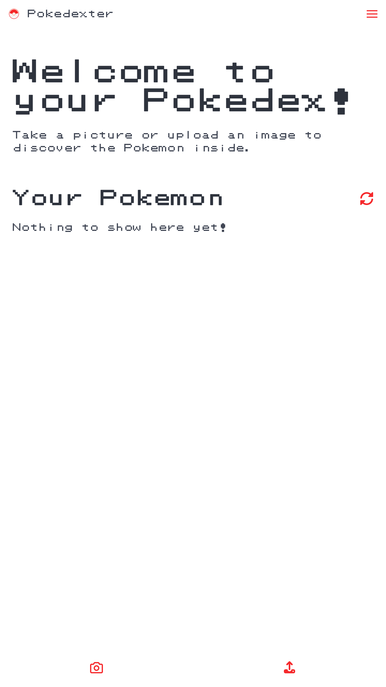
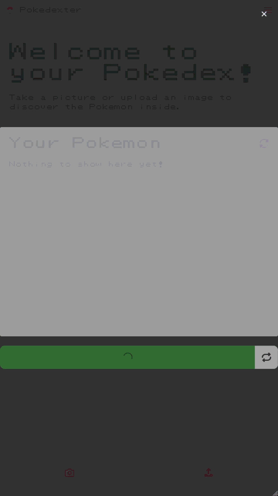
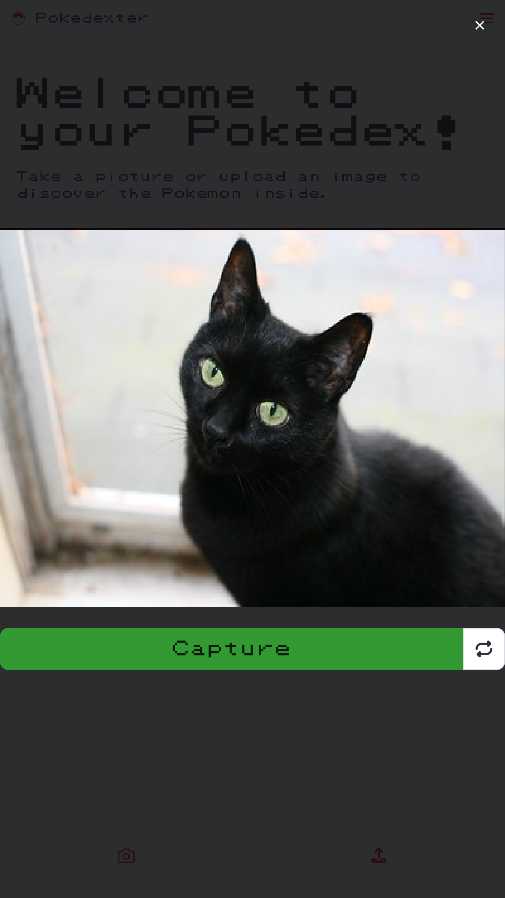
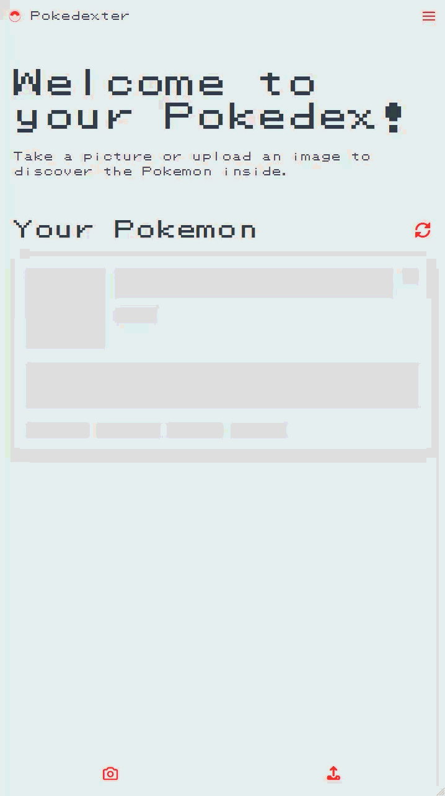
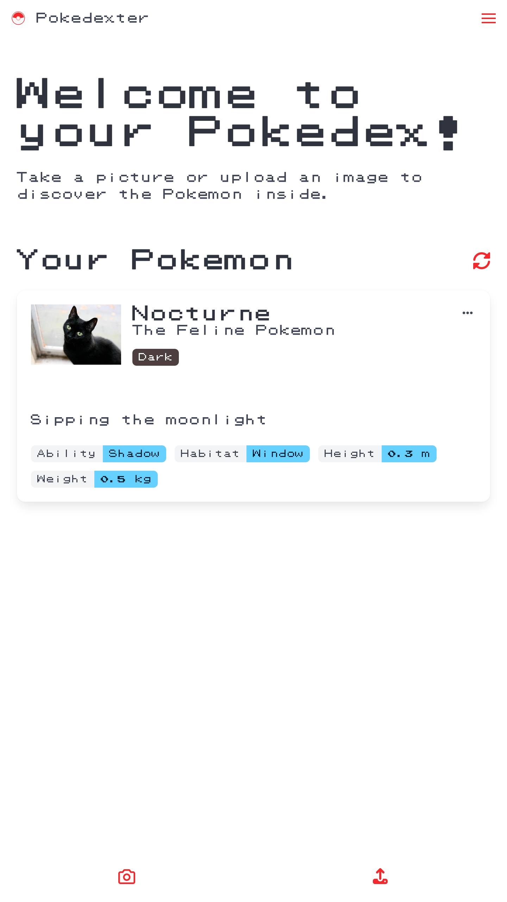
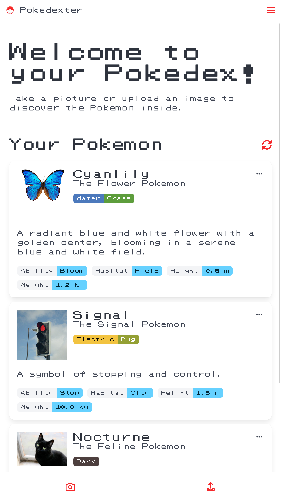
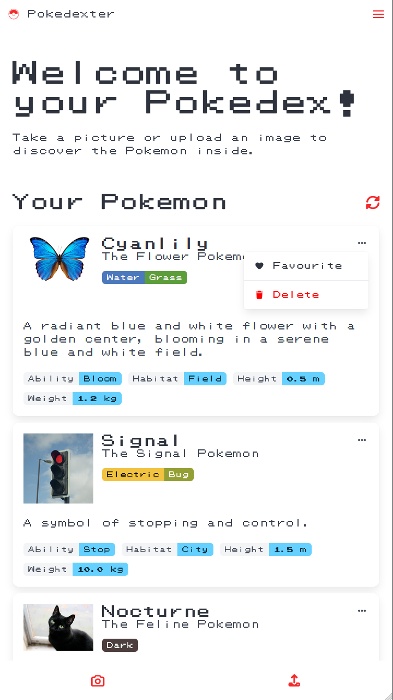
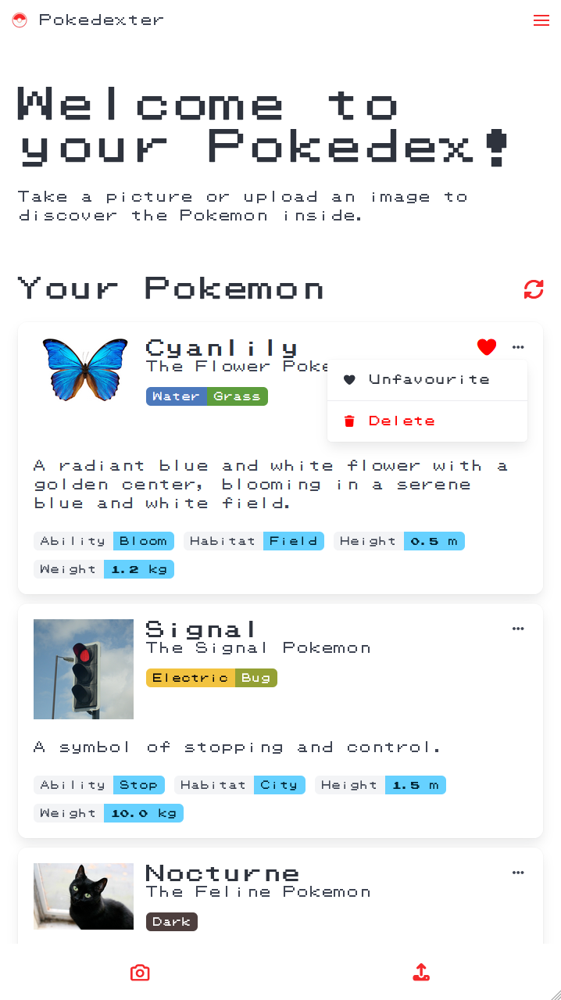
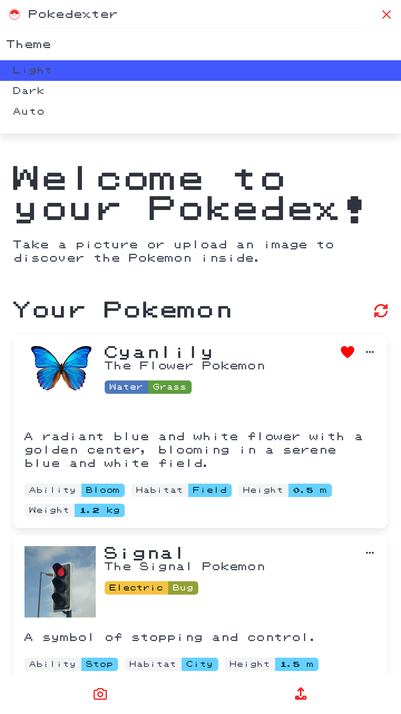
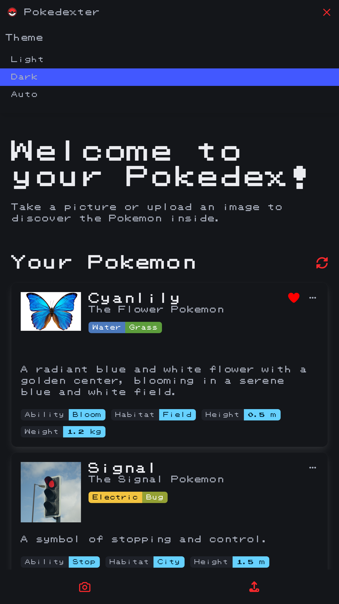

# User Guide

Welcome to the user guide for Pokedexter! This guide will help you get started building your Pokémon collection.

Open Pokedexter in your favorite web browser to get started!

!!! TIP "Use Pokedexter on your phone"

    Open Pokedexter on your phone to identify Pokémon wherever you are!

## Home Page

The home page is the main screen of the app. Let's go through its step by step:

    

At the top of the page is a welcome message and some instructions on how to get started. Below that is your Pokémon collection,
which is empty for now.

The app is telling us to take a picture or upload an image to discover the Pokémon inside. Let's do that now!

## Taking a Picture

To start taking a picture, click the camera icon at the bottom of the screen. This will pop up the camera interface, allowing
you to take a picture of the object you would like to identify.

    

    

While loading, you can see the camera interface preparing to take a picture. You may at this point be prompted to allow
camera access if you haven't already done so.

!!! INFO "Grant Camera Access"

    You will not be able to use the camera feature until you grant access. If you deny access by mistake, you can refresh the page to
    be prompted again, or enable it again in your device settings.

Once ready, the camera image will appear on the screen. You can now take a picture by clicking the **capture** button.
This will process the image and attempt to identify the Pokémon within it.

!!! TIP "Switching Cameras"

    If your device has more than one camera (such as front and back cameras), you can switch between them by clicking the **switch camera**
    button in the camera interface, located next to the **capture** button.

## Uploading an Image

If you prefer to upload an image instead of using the camera, you can do so by clicking the **upload** button at the bottom
of the screen. This will open a file dialog, allowing you to select an image file from your device.

!!! TIP "Access your Camera App"

    If you prefer to use your phone's camera app, it will also be available as an option in the upload dialog.

Once you have selected an image, the app will process it and attempt to identify the Pokémon within it.

## Analyzing the Image

Now, the app will analyze the image and try to detect any Pokémon present. This may take a few moments, so please be patient.
While you wait, you can try to guess which Pokémon it might come up with!

Once the image has been processed, the app will display the results, showing the identified Pokémon along with their details.

    

    

## Building your Collection

Congratulations on capturing your first Pokémon! You can now view it in your collection and continue to add more Pokémon
as you discover them.

!!! INFO "Saving Your Collection"

    Your collection is automatically saved on your device so you don't lose your progress.

Here's what it looks like when there's a few more Pokémon in your collection:

    

## Managing your Collection

Once you've started building your collection, you may want to show your love for a specific Pokémon. You can mark it as
a favorite by clicking the **favourite** button in the Pokémon details view. A heart icon will appear next to the Pokémon's
name!

If you ever change your mind, you can also unfavourite a Pokémon by clicking the **unfavourite** button. If you'd like
to remove a Pokémon from your collection entirely, you can do so by clicking the **delete** button at the bottom of the
details view.

    

    

## Switching the Theme

By default, the app will use your system's theme preference (light or dark). However, you can change the theme manually
by clicking the **theme** buttons in the app settings.

You can switch back to your system default by selecting **auto**.

    

    

Happy exploring!
